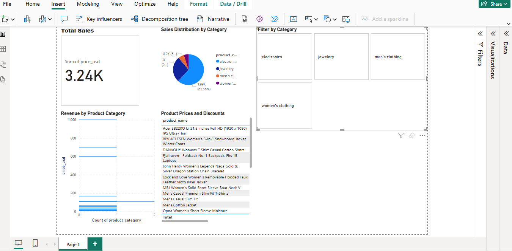

# 🛍️ Retail Sales Dashboard

This is a complete **end-to-end data analytics project** that analyzes retail sales data using Python and Power BI. It simulates the real-world process of data collection, cleaning, exploration, visualization, and dashboard reporting.

---

## 🚀 Project Overview

**Project Goal**:  
Analyze retail product sales from a live API, clean the data using Python, and create an interactive Power BI dashboard to identify top-selling categories, estimate revenue, and visualize overall business performance.

---

## 🛠️ Tools & Technologies

- 🐍 Python (Pandas, Requests)
- 📡 REST API (`https://fakestoreapi.com/products`)
- 🧹 Data Cleaning in Jupyter (PyCharm Notebooks)
- 📊 Power BI (Dashboard Reporting)
- 🧾 GitHub (Version Control)

---

## 📂 Project Structure

Retail_Sales_Dashboard/
├── data/ # Cleaned datasets (.csv)
├── notebooks/ # Python scripts and notebooks
├── visuals/ # Power BI .pbix + chart images
├── README.md # Project documentation
└── .gitignore

---

## 🧪 Key Steps Performed

1. **Data Collection**  
   - Pulled product data from a public API using `requests`.

2. **Data Cleaning**  
   - Removed nulls, extracted pricing and discount insights, structured product categories.

3. **Exploratory Data Analysis (EDA)**  
   - Grouped by category, estimated revenue and discount impact.

4. **Power BI Dashboard**  
   - Created interactive visuals:
     - Revenue cards
     - Top-selling product chart
     - Discount-wise breakdown
     - Slicers by category

5. **Deployment**  
   - Version controlled using Git.
   - Uploaded to GitHub with full project structure.

---

## 📸 Dashboard Preview

📊 [Click here to download the Power BI dashboard (.pbix)](visuals/dashboard.pbix)

> 🔗 Full Power BI file available at: `visuals/dashboard.pbix`

---

## 🔚 Outcomes

- Developed strong understanding of data cleaning, visualization, and dashboarding.
- Practical use of API data with real analytics insights.
- Project ready to showcase to clients and recruiters.

---

## 🔗 GitHub Repo

This project is hosted at:  
**https://github.com/IrfanWazeer/Retail_Sales_Dashboard**

---

## 📬 Let's Connect

If you’re interested in more real-world data projects or collaborations:  
**🔗 LinkedIn**: [linkedin.com/in/arfanwazeer](https://linkedin.com/in/arfanwazeer)  
**📧 Email**: [irfanwazeer2@gmail.com]

---

